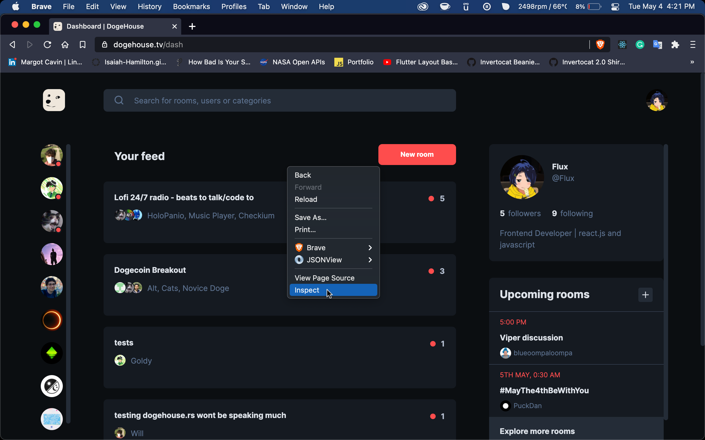
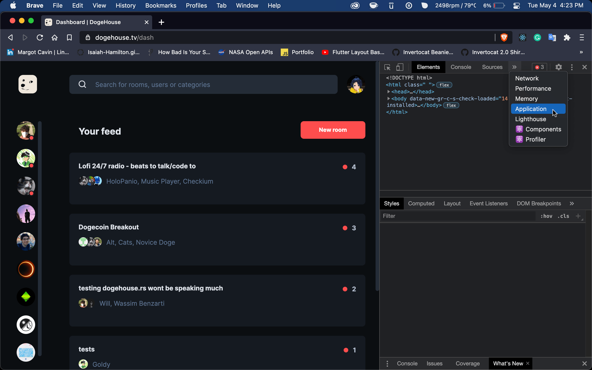
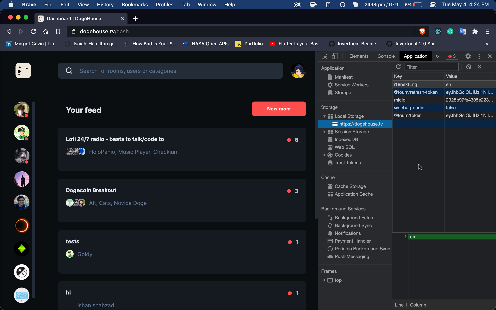

<!-- Made By Isaiah-Hamilton(https://github.com/Isaiah-Hamilton) -->
<!-- GETTING STARTED -->

# How to create a bot

After you learned how to install moonstone from the main [README.md](https://github.com/fuwwy/moonstone/blob/main/README.md), you can now make a bot for [dogehouse.tv](dogehouse.tv).

<!-- Steps -->

## Create a bot account

- First you will have to a new Javascript file in your folder, and name auth.js

<br>

- In your auth.js file put the following:
  ```js
  const accessToken = "TOKEN";
  const refreshToken = "REFRESH_TOKEN";
  ```
  Replace TOKEN with your token and REFRESH_TOKEN with your refresh token from [dogehouse.tv](dogehouse.tv). If you don't know how to get your refresh token, then click [here](#how-to-get-your-tokens).

<br>

- Create another Javascript file and name it index.js We are going to use the [createBotAccount.js]() example.

<br>

- In your index.js file put the following:

  ```js
  const Moonstone = require("../");
  const bot = Moonstone(require("./auth"));

  bot.on("ready", async (user) => {
    console.log("Ready! Logged in as " + user.username);

    const botAccountData = await bot.createBotAccount("testbotusername");
    console.log(botAccountData);
  });

  bot.connect(); // Connect the bot to Dogehouse
  ```

<br>

- To run your new doge bot, go to your terminal put the following:
  ```
  cd "FILE/PATH"
  node index.js
  ```

<br>

More examples can be found in [the examples folder](https://github.com/fuwwy/moonstone/tree/main/examples).

- [Welcomer Example](https://github.com/fuwwy/moonstone/blob/main/examples/welcomer.js)
- [Music Example](https://github.com/fuwwy/moonstone/blob/main/examples/music.js)
- [createBotAccount Example](https://github.com/fuwwy/moonstone/blob/main/examples/createBotAccount.js)

<br>

<!-- Help find tokens -->

# How to get your Tokens

<br>

- First you will have to go to [dogehouse.tv](dogehouse.tv), and right click anywhere and press inspect.



<br>
<br>

- Second you will have to go to application tab



<br>
<br>

- Thrid you will have to go to local storage and your tokens will be there.



<br>
<br>

## Support

You can find me on the [DogeGarden Discord](https://discord.gg/pPaXCRrVrh) (Checkium#4508) or my own [official support server](https://discord.gg/hDj42dMhn9).

<!-- LICENSE -->

## License

Distributed under the MIT License. See `LICENSE` for more information.

<!-- If you are a Contributor then add your name to the list below -->

## Contributors

- [fuwwy](https://github.com/fuwwy)
- [Isaiah-Hamilton](https://github.com/Isaiah-Hamilton)
